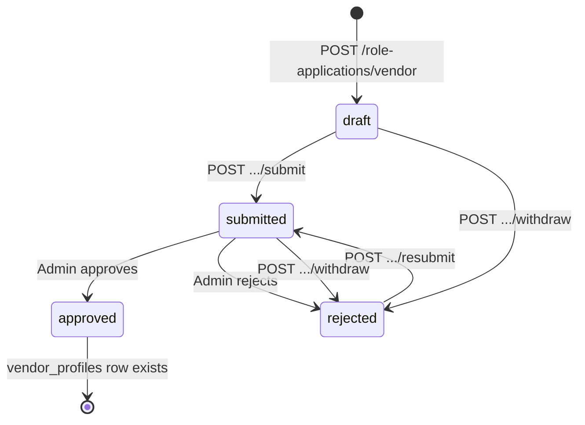

# Vendor API — frontend implementation guide

**Date:** 2026-05-23  
**API base:** `https://<host>/api/v1/main`  
**Auth scope:** Sanctum token with ability `app:main` (`app.scope:main_website` middleware)  
**Related:** [`frontend-handoff-talent-api.md`](frontend-handoff-talent-api.md), [`API_REFERENCE.md`](API_REFERENCE.md), [`docs/sprints/PHASE-04-role-applications.md`](sprints/PHASE-04-role-applications.md), [`docs/sprints/PHASE-05-marketplace-profiles.md`](sprints/PHASE-05-marketplace-profiles.md)

---

## Summary

| Phase | Who | Key endpoints |
|-------|-----|----------------|
| **Browse** | Public | `GET /vendors`, `GET /vendors/{slug}`, `GET /vendors/{slug}/ratings` |
| **Apply** | Logged-in guest | `POST /role-applications/vendor`, `PATCH`, documents, gallery, submit |
| **Live profile** | Approved vendor | `GET/PATCH /me/vendor-profile` |
| **Hiring** | Vendor (target) | `GET /me/engagements`, accept/decline/messages/complete |

After admin **approval**, a `vendor_profiles` row is provisioned and the user role becomes `vendor`. Until then, use **role application** endpoints only.

---

## Authentication

Protected routes require:

```http
Authorization: Bearer <sanctum_token>
```

Obtain via `POST /api/v1/main/auth/login` (main website app scope).

| HTTP | Meaning |
|------|---------|
| **401** | Missing/invalid token |
| **403** | Authenticated but not allowed (rare on vendor routes) |
| **404** | Resource not found or not owned |
| **422** | Validation or business-rule failure |

---

## Standard error shapes

### Validation (`422`)

```json
{
  "message": "The given data was invalid.",
  "errors": {
    "profile_name": ["The profile name field is required."]
  }
}
```

### Business rule (`422`, single message)

```json
{
  "message": "Vendor application payload is incomplete."
}
```

```json
{
  "message": "Invalid status transition from submitted to submitted."
}
```

```json
{
  "message": "Only rejected applications can be resubmitted."
}
```

```json
{
  "message": "Approved applications cannot be withdrawn."
}
```

```json
{
  "message": "Application type mismatch."
}
```

### Not found (`404`)

```json
{
  "message": "No query results for model [App\\Models\\VendorProfile] ..."
}
```

---

## Lifecycle diagram



**Status enum:** `not_started` | `draft` | `submitted` | `approved` | `rejected`  
(Withdrawn applications are stored as `rejected` with `rejection_reason: "Withdrawn by applicant"`.)

One vendor application per user (`unique user_id + application_type`).

---

## 1. Public discovery (no auth)

### `GET /vendors`

Paginated list of **active** vendor profiles.

**Query parameters**

| Param | Type | Description |
|-------|------|-------------|
| `city_id` | integer | Filter by `city_id` |
| `page` | integer | Laravel pagination (default page size **20**) |

**Success `200`** — Laravel paginator (no `{ data }` wrapper):

```json
{
  "current_page": 1,
  "data": [
    {
      "id": 7,
      "user_id": 33,
      "application_id": 11,
      "slug": "catering-plus-7",
      "business_name": "Catering Plus",
      "bio": "Premium event catering",
      "region_id": 1,
      "city_id": 3,
      "coverage_area": "Riyadh & Dammam",
      "profile_image_url": "https://cdn.example.com/logo.jpg",
      "website_url": "https://catering.example.com",
      "instagram_handle": "@cateringplus",
      "availability_status": "available",
      "rating_average": "4.80",
      "rating_count": 24,
      "completed_bookings": 18,
      "is_active": true,
      "created_at": "2026-05-01T10:00:00.000000Z",
      "updated_at": "2026-05-10T12:00:00.000000Z",
      "deleted_at": null
    }
  ],
  "per_page": 20,
  "total": 1
}
```

---

### `GET /vendors/{slug}`

**Success `200`**

```json
{
  "data": {
    "id": 7,
    "slug": "catering-plus-7",
    "business_name": "Catering Plus",
    "bio": "...",
    "coverage_area": "Riyadh & Dammam",
    "profile_image_url": "...",
    "website_url": "https://catering.example.com",
    "instagram_handle": "@cateringplus",
    "availability_status": "available",
    "rating_average": "4.80",
    "rating_count": 24,
    "completed_bookings": 18,
    "categories": [
      {
        "id": 1,
        "vendor_profile_id": 7,
        "service_category_id": 2
      }
    ],
    "gallery": [
      {
        "id": 1,
        "vendor_profile_id": 7,
        "image_url": "https://cdn.example.com/spread.jpg",
        "caption": "Wedding buffet",
        "position": 0,
        "created_at": "2026-05-01T10:00:00.000000Z"
      }
    ]
  }
}
```

**Failure `404`:** unknown or inactive slug.

---

### `GET /vendors/{slug}/ratings`

**Success `200`** — paginator; each rating includes `comment` (not `review`):

```json
{
  "current_page": 1,
  "data": [
    {
      "id": 120,
      "user_id": 8,
      "target_type": "vendor",
      "target_id": 7,
      "engagement_id": 12,
      "stars": 5,
      "comment": "Excellent service",
      "is_visible": true,
      "created_at": "2026-05-15T08:00:00.000000Z",
      "updated_at": "2026-05-15T08:00:00.000000Z",
      "deleted_at": null
    }
  ],
  "per_page": 20,
  "total": 1
}
```

---

## 2. Role application (onboarding)

Base path: **`/role-applications`** (auth required).

### `GET /role-applications/me`

Includes vendor row when `application_type === "vendor"`. See talent guide for full envelope.

---

### `GET /role-applications/vendor/{id}`

**Success `200`:** `{ "data": { ...role_application, "vendor_application": { "documents": [...], "gallery": [...] } } }`

---

### `POST /role-applications/vendor`

Create or reopen draft.

**Body**

| Field | Type | Required | Rules |
|-------|------|----------|-------|
| `profile_name` | string | Yes | max 160 — business/display name |
| `contact_email` | string | Yes | valid email |
| `contact_phone` | string | No | max 20 |

**Success `201`**

```json
{
  "data": {
    "id": 4,
    "user_id": 19,
    "application_type": "vendor",
    "status": "draft",
    "vendor_application": {
      "id": 3,
      "application_id": 4,
      "profile_name": "Catering Plus",
      "contact_email": "hello@catering.example.com",
      "contact_phone": "+966500000001"
    }
  }
}
```

---

### `PATCH /role-applications/vendor/{id}`

**Vendor-relevant body fields**

| Field | Maps to DB | Notes |
|-------|------------|-------|
| `business_name` | `vendor_applications.profile_name` | **API name differs from create field** |
| `contact_email` | `contact_email` | |
| `contact_phone` | `contact_phone` | |
| `bio` | `bio` | |
| `city` | `city_id` | integer (Saudi city id) |
| `coverage_area` | `coverage_area` | max 255 |
| `internal_note` | `role_applications.internal_note` | |

**Success `200`:** `{ "data": { ...full application with documents + gallery } }`

---

### `POST /role-applications/vendor/{id}/documents`

**Body**

| Field | Type | Required | Rules |
|-------|------|----------|-------|
| `kind` | string | Yes | `url` \| `document` |
| `value` | string | Yes | URL or path, max 500 |
| `label` | string | No | max 255 |
| `position` | integer | No | min 0 |

**Success `201`**

```json
{
  "data": {
    "id": 5,
    "vendor_application_id": 3,
    "kind": "document",
    "value": "https://cdn.example.com/license.pdf",
    "label": "Commercial registration",
    "position": 0,
    "created_at": "2026-05-20T11:00:00.000000Z"
  }
}
```

---

### `DELETE /role-applications/vendor/{id}/documents/{docId}`

**Success `200`:** `{ "message": "Deleted" }`

---

### `POST /role-applications/vendor/{id}/gallery`

**Body**

| Field | Type | Required | Rules |
|-------|------|----------|-------|
| `image_url` | string | Yes | max 500 |
| `caption` | string | No | max 255 |
| `position` | integer | No | min 0 |

**Success `201`**

```json
{
  "data": {
    "id": 8,
    "vendor_application_id": 3,
    "image_url": "https://cdn.example.com/booth.jpg",
    "caption": "Trade show setup",
    "position": 0,
    "created_at": "2026-05-20T11:30:00.000000Z"
  }
}
```

---

### `DELETE /role-applications/vendor/{id}/gallery/{itemId}`

**Success `200`:** `{ "message": "Deleted" }`

---

### `POST /role-applications/vendor/{id}/submit`

Requires `profile_name` and `contact_email` on typed row.

**Success `200`:** `{ "data": { "status": "submitted", "submitted_at": "..." } }`

**Failure `422`**

- `"Vendor application payload is incomplete."`
- Invalid status transition if already submitted

---

### `POST /role-applications/vendor/{id}/resubmit`

From **`rejected`** only.

**Success `200`:** `{ "data": { "status": "submitted", ... } }`  
**Failure `422`:** `"Only rejected applications can be resubmitted."`

---

### `POST /role-applications/vendor/{id}/withdraw`

**Success `200`:** `{ "data": { "status": "rejected", "rejection_reason": "Withdrawn by applicant" } }`  
**Failure `422`:** `"Approved applications cannot be withdrawn."`

---

## 3. Approved profile (post-approval)

### `GET /me/vendor-profile`

**Success `200`**

```json
{
  "data": {
    "id": 7,
    "user_id": 19,
    "slug": "catering-plus-7",
    "business_name": "Catering Plus",
    "bio": "...",
    "region_id": 1,
    "city_id": 3,
    "coverage_area": "Riyadh & Dammam",
    "profile_image_url": "...",
    "website_url": "https://catering.example.com",
    "instagram_handle": "@cateringplus",
    "availability_status": "available",
    "rating_average": "4.80",
    "rating_count": 24,
    "completed_bookings": 18,
    "is_active": true,
    "created_at": "...",
    "updated_at": "..."
  }
}
```

**Failure `404`:** no profile for user.

---

### `PATCH /me/vendor-profile`

| Field | Type | Rules |
|-------|------|-------|
| `business_name` | string | max 160 |
| `bio` | string | nullable |
| `website_url` | string | nullable, valid URL, max 500 |
| `instagram_handle` | string | nullable, max 120 |
| `coverage_area` | string | nullable, max 255 |

**Success `200`:** `{ "data": { ...updated profile } }`

**Note:** There is no API to update profile gallery or service categories after approval; those are provisioned from the application at approval time.

---

## 4. Engagements (vendor as hire target)

Organizers create via `POST /me/engagements` with `target_type: "vendor"`. Vendors use the same engagement endpoints as talent (`target_user_id` match).

### `GET /me/engagements`

**Success `200`** — paginator; `target_type` is `"vendor"`, `sender` on messages is `"vendor"`.

Example row:

```json
{
  "id": 12,
  "organizer_user_id": 8,
  "target_type": "vendor",
  "target_id": 7,
  "target_user_id": 19,
  "related_event_id": 18,
  "topic": "Catering for 500 guests",
  "preview": "Buffet + beverages",
  "status": "pending",
  "created_at": "2026-05-20T14:00:00.000000Z"
}
```

### Actions (auth as vendor)

| Method | Path | Body | Result status |
|--------|------|------|---------------|
| POST | `/me/engagements/{id}/accept` | — | `accepted` |
| POST | `/me/engagements/{id}/decline` | optional `reason` | `declined` |
| POST | `/me/engagements/{id}/messages` | `body`, optional `attachment_url` | message created |
| POST | `/me/engagements/{id}/complete` | — | `closed` |

**Transition rules**

- `pending` → `accepted` | `declined` | `cancelled`
- `accepted` → `closed` | `cancelled`
- Other transitions → **422** `"Invalid engagement status transition ..."`

---

## 5. Ratings (related)

Vendors **receive** ratings. Organizers create via `POST /ratings` with `target_type: "vendor"` and `target_id` = **vendor profile id** (not user id), after a **closed** engagement.

Response field is **`comment`**; request field when creating is **`review`**.

---

## Naming cheat sheet

| Concept | Create application | PATCH application | Live profile |
|---------|-------------------|-------------------|--------------|
| Business name | `profile_name` | `business_name` | `business_name` |

---

## TypeScript reference

```ts
export type RoleApplicationStatus =
  | 'not_started'
  | 'draft'
  | 'submitted'
  | 'approved'
  | 'rejected';

export type EngagementStatus =
  | 'pending'
  | 'accepted'
  | 'declined'
  | 'cancelled'
  | 'closed';

export interface VendorProfile {
  id: number;
  user_id: number;
  slug: string;
  business_name: string;
  bio: string | null;
  region_id: number | null;
  city_id: number | null;
  coverage_area: string | null;
  profile_image_url: string | null;
  website_url: string | null;
  instagram_handle: string | null;
  availability_status: 'available' | 'reserved';
  rating_average: string;
  rating_count: number;
  completed_bookings: number;
  is_active: boolean;
  categories?: VendorProfileCategory[];
  gallery?: VendorProfileGalleryItem[];
}

export interface VendorApplicationDocument {
  id: number;
  kind: 'url' | 'document';
  value: string;
  label: string | null;
  position: number;
}

export interface VendorApplicationGalleryItem {
  id: number;
  image_url: string;
  caption: string | null;
  position: number;
}

export interface LaravelPaginator<T> {
  current_page: number;
  data: T[];
  per_page: number;
  total: number;
  last_page: number;
  next_page_url: string | null;
  prev_page_url: string | null;
}
```

---

## Frontend checklist

- [ ] Onboarding → `POST /role-applications/vendor` with `profile_name`
- [ ] Edit draft → `PATCH` with `business_name` (not `profile_name`)
- [ ] Upload docs/gallery URLs before submit
- [ ] Submit when `profile_name` + `contact_email` present
- [ ] After approval → `GET /me/vendor-profile`
- [ ] Marketplace links use **`slug`**
- [ ] Engagements inbox shared with talent UI (`GET /me/engagements`)
- [ ] No multipart upload in API — upload to storage first, send URLs

---

## Out of scope (this guide)

- Admin review/approve (`/api/v1/admin/...`)
- Organizer attaching vendors to events (`/api/v1/organizer/events/{id}/vendors`)
- Direct file upload endpoints (pass CDN URLs in JSON)
