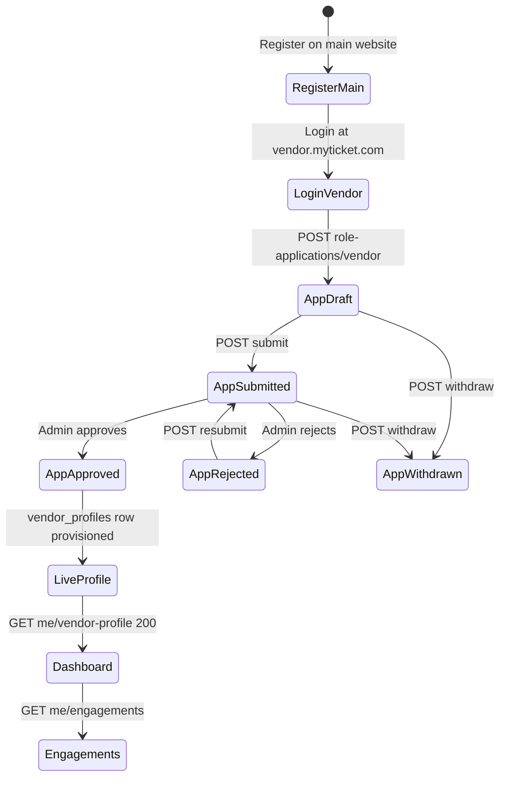
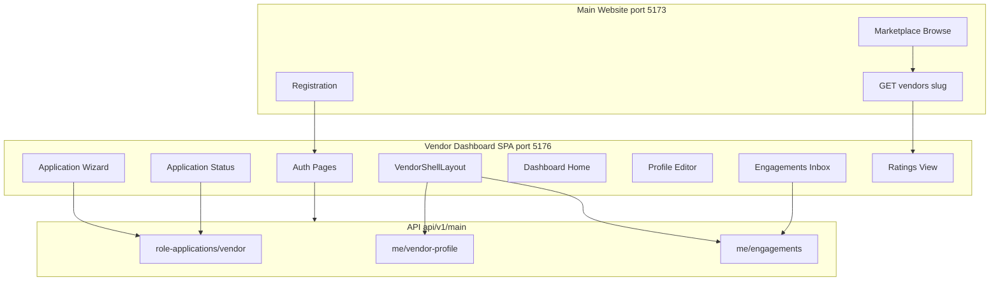
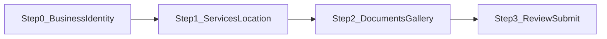
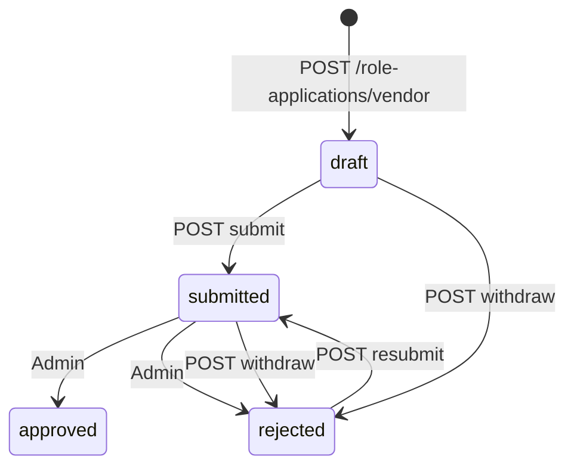

# MyTicket — Vendor Dashboard Build Guide

> **Type:** Vendor Dashboard (Standalone micro-frontend)  
> **URL:** `vendor.myticket.com` (dev: `http://localhost:5176`)  
> **Users:** Guest applicants → approved Vendor  
> **Stack:** Bun · Vite 8 · React 19 · TypeScript · Tailwind CSS 4 · Lucide React · shadcn/ui · Redux Toolkit · RTK Query · react-hook-form · Yup · react-i18next  
> **Master references:** [`myticket_platform_flow.md`](myticket_platform_flow.md) · [`myticket_shared_flow.md`](../myticket_shared_flow.md) · [`CLAUDE_DESIGN_SYSTEM.md`](CLAUDE_DESIGN_SYSTEM.md) · [`frontend-handoff-vendor-api.md`](frontend-handoff-vendor-api.md)  
> **Migration sources:** [`main/`](../main/) (`VendorSteps`, `EngagementsPage`, `baseApi`, schemas) · [`organizer/`](../organizer/) (shell layout, nav pattern) · [`talent/`](../talent/) (working micro-frontend reference)  
> **Last Updated:** June 2026

---

## Table of Contents

1. [Overview and Architecture](#1-overview-and-architecture)
2. [Project Bootstrap (Bun + Vite)](#2-project-bootstrap-bun--vite)
3. [Design System Implementation](#3-design-system-implementation)
4. [Authentication and Authorization](#4-authentication-and-authorization)
5. [API Layer (RTK Query)](#5-api-layer-rtk-query)
6. [Yup Schemas](#6-yup-schemas)
7. [Application Wizard (Pre-Approval)](#7-application-wizard-pre-approval)
8. [Post-Approval Dashboard Pages](#8-post-approval-dashboard-pages)
9. [Internationalization (AR/EN + RTL)](#9-internationalization-aren--rtl)
10. [State Management Layout](#10-state-management-layout)
11. [Cross-App Integration](#11-cross-app-integration)
12. [Testing and Quality Checklist](#12-testing-and-quality-checklist)
13. [Implementation Phases](#13-implementation-phases)
14. [Appendix](#14-appendix)

---

## 1. Overview and Architecture

### 1.1 Product role

The **Vendor Dashboard** is the sixth MyTicket micro-frontend. It gives event service providers (catering, security, AV, venue rental, staffing, etc.) a dedicated workspace to:

- Apply for the Vendor role (onboarding wizard)
- Track application review status
- Manage their live marketplace profile (post-approval)
- Display and manage availability (`available` / `reserved`)
- Respond to organizer hiring requests (engagements inbox + messaging)
- View star ratings received from organizers

It does **not** replace the main website for event discovery, ticket purchase, or organizer-initiated marketplace browsing.

### 1.2 Platform split

| Concern | Owner app | Notes |
|---|---|---|
| User registration | **Main website** (`myticket.com`) | Only app where new accounts are created ([`myticket_shared_flow.md` §3.1](../myticket_shared_flow.md)) |
| Vendor role application wizard | **Vendor dashboard** | `POST /role-applications/vendor` and lifecycle |
| Post-approval profile | **Vendor dashboard** | `GET/PATCH /me/vendor-profile` |
| Engagements inbox (vendor side) | **Vendor dashboard** | `GET /me/engagements`, accept/decline/message/complete |
| Public vendor profile page | **Main website** | `GET /vendors/{slug}` — marketplace discovery |
| Organizer initiates hiring | **Main website / Organizer dashboard** | `POST /me/engagements` (organizer only) |
| My Tickets, booking, auction | **Main website** | Link out via `VITE_MAIN_WEBSITE_URL` |
| Admin approval | **Admin dashboard** | Out of scope for this guide |

### 1.3 User lifecycle



**Application status enum** (from API): `not_started` | `draft` | `submitted` | `approved` | `rejected`  
(Withdrawn applications are stored as `rejected` with `rejection_reason: "Withdrawn by applicant"`.)

### 1.4 Access matrix

| `user.role` | Application `status` | `GET /me/vendor-profile` | Allowed routes |
|---|---|---|---|
| `guest` | none | — | `/application` (start wizard), `/login` |
| `guest` | `draft` / `rejected` | 404 | `/application`, `/application/status` |
| `guest` | `submitted` | 404 | `/application/status` (read-only) |
| `vendor` | `approved` | 200 | Full dashboard (`/`, `/profile`, `/engagements`, …) |
| `talent` / `organizer` | any | — | `/access-denied` |
| any | — | — | `/login`, `/forgot-password`, `/reset-password` |

### 1.5 Post-login routing logic

Implement in `src/lib/resolvePostLoginRoute.ts`:

```ts
import type { RoleApplicationStatus } from '@/api/types/roleApplication';

export function resolvePostLoginRoute(input: {
  role: string | null;
  hasVendorApplication: boolean;
  applicationStatus: RoleApplicationStatus | null;
  hasVendorProfile: boolean;
}): string {
  const { role, hasVendorApplication, applicationStatus, hasVendorProfile } = input;

  if (role === 'talent' || role === 'organizer') return '/access-denied';
  if (hasVendorProfile || role === 'vendor') return '/';
  if (!hasVendorApplication) return '/application';
  if (applicationStatus === 'submitted') return '/application/status';
  if (applicationStatus === 'draft' || applicationStatus === 'rejected') return '/application';
  if (applicationStatus === 'approved') return '/'; // profile may still be provisioning
  return '/application';
}
```

Poll `GET /me/vendor-profile` after `approved` — 404 means provisioning is not finished; show a holding screen on `/application/status`.

### 1.6 Key business rules (Vendor-specific)

From [`myticket_platform_flow.md`](myticket_platform_flow.md) §15.2, §15.4, §15.6, §16:

- **Vendor** is distinct from Talent — Vendors provide logistical services; Talents provide artistic/performance services.
- Role selection is **final** — once approved as Vendor, no role switching.
- Marketplace financial arrangements happen **outside** the platform.
- Vendors must provide **verification documents** (business license, commercial registration) and an **image gallery** during onboarding.
- **Service categories** (venue, catering, security, lighting, sound, etc.) are selected during application and provisioned to the live profile at approval — not editable post-approval via current API.
- Availability auto-changes to `reserved` when a vendor **accepts** an engagement; vendor can manually switch back to `available` (see [§14.6](#146-backend-gaps--coordination-items) for API gap).
- Ratings are **stars only** on the product surface (no written reviews displayed to users).
- Platform currency is **SAR**; UI is **bilingual AR/EN** with full RTL/LTR.
- Media URLs sent to the API must be **already-uploaded** public URLs (no multipart on role-application endpoints).

### 1.7 Architecture overview



---

## 2. Project Bootstrap (Bun + Vite)

### 2.1 Prerequisites

- [Bun](https://bun.sh) ≥ 1.1
- Node.js 20+ (for tooling compatibility)
- Running MyTicket API at `http://localhost:8000` (or your staging host)

### 2.2 Scaffold commands

From the monorepo root (`my-ticket-website/`):

```bash
cd vendor
bun create vite . --template react-ts
bun add react@^19 react-dom@^19 react-router-dom@^7 \
  @reduxjs/toolkit react-redux \
  react-hook-form @hookform/resolvers yup \
  i18next react-i18next i18next-browser-languagedetector \
  lucide-react clsx tailwind-merge class-variance-authority \
  @fontsource/plus-jakarta-sans @fontsource/space-grotesk \
  @emran-alhaddad/saudi-riyal-font sonner
bun add -d tailwindcss @tailwindcss/vite tw-animate-css typescript vite @vitejs/plugin-react \
  eslint typescript-eslint vitest @testing-library/react jsdom
bunx shadcn@latest init
bunx shadcn@latest add button card badge dialog sheet tabs input textarea select sonner
```

### 2.3 Recommended `package.json` scripts

```json
{
  "name": "myticket-vendor",
  "private": true,
  "type": "module",
  "scripts": {
    "dev": "vite --port 5176",
    "build": "tsc -b && vite build",
    "lint": "eslint .",
    "preview": "vite preview --port 5176",
    "test": "vitest run"
  }
}
```

### 2.4 Folder tree

```
vendor/
├── public/
├── src/
│   ├── api/
│   │   ├── authToken.ts
│   │   ├── baseApi.ts
│   │   ├── types/
│   │   │   ├── auth.ts
│   │   │   ├── common.ts
│   │   │   ├── engagement.ts
│   │   │   ├── roleApplication.ts
│   │   │   ├── vendor.ts
│   │   │   ├── user.ts
│   │   │   └── reference.ts
│   │   └── endpoints/
│   │       ├── auth.ts
│   │       ├── engagements.ts
│   │       ├── index.ts
│   │       ├── me.ts
│   │       ├── ratings.ts
│   │       ├── reference.ts
│   │       ├── roleApplications.ts
│   │       └── vendors.ts
│   ├── components/
│   │   ├── auth/
│   │   │   ├── RequireAuth.tsx
│   │   │   ├── RequireApprovedVendor.tsx
│   │   │   └── RequireVendorCandidate.tsx
│   │   ├── forms/
│   │   │   ├── Field.tsx
│   │   │   ├── CharCounter.tsx
│   │   │   └── SaudiPhoneInput.tsx
│   │   ├── i18n/
│   │   │   └── PreferencesLanguageSync.tsx
│   │   ├── layout/
│   │   │   ├── Sidebar.tsx
│   │   │   ├── TopBar.tsx
│   │   │   └── VendorShell.tsx
│   │   ├── vendor/
│   │   │   ├── ApplicationStatusBanner.tsx
│   │   │   ├── AvailabilityBadge.tsx
│   │   │   ├── DocumentManager.tsx
│   │   │   ├── EngagementThread.tsx
│   │   │   ├── GalleryManager.tsx
│   │   │   ├── PublicProfilePreviewCard.tsx
│   │   │   ├── ServiceCategoryPicker.tsx
│   │   │   └── StatBubble.tsx
│   │   └── ui/                    # shadcn primitives
│   ├── config/
│   │   ├── env.ts
│   │   └── nav.ts
│   ├── contexts/
│   │   ├── AuthContext.tsx
│   │   └── vendorAuthContext.ts
│   ├── hooks/
│   │   └── useAuth.ts
│   ├── i18n/
│   │   ├── index.ts
│   │   └── locales/
│   │       ├── en.json
│   │       └── ar.json
│   ├── layouts/
│   │   ├── ApplicationLayout.tsx
│   │   ├── PublicAuthLayout.tsx
│   │   └── VendorShellLayout.tsx
│   ├── lib/
│   │   ├── apiErrors.ts
│   │   ├── engagementMappers.ts
│   │   ├── onboardingValidation.ts
│   │   ├── resolvePostLoginRoute.ts
│   │   ├── roleApplicationMappers.ts
│   │   ├── saudiLocations.ts
│   │   ├── upload.ts
│   │   ├── vendorServiceCategories.ts
│   │   └── utils.ts
│   ├── pages/
│   │   ├── application/
│   │   │   ├── ApplicationStatusPage.tsx
│   │   │   └── ApplicationWizardPage.tsx
│   │   ├── auth/
│   │   │   ├── AccessDeniedPage.tsx
│   │   │   ├── ForgotPasswordPage.tsx
│   │   │   ├── LoginPage.tsx
│   │   │   ├── OAuthCallbackPage.tsx
│   │   │   └── ResetPasswordPage.tsx
│   │   ├── dashboard/
│   │   │   └── HomePage.tsx
│   │   ├── engagements/
│   │   │   ├── EngagementDetailPage.tsx
│   │   │   └── EngagementsPage.tsx
│   │   ├── profile/
│   │   │   ├── AvailabilityPage.tsx
│   │   │   ├── ProfilePage.tsx
│   │   │   └── PublicProfilePreviewPage.tsx
│   │   ├── ratings/
│   │   │   └── RatingsPage.tsx
│   │   └── settings/
│   │       └── SettingsPage.tsx
│   ├── schemas/
│   │   ├── application.ts
│   │   ├── auth.ts
│   │   ├── engagement.ts
│   │   ├── index.ts
│   │   └── profile.ts
│   ├── store/
│   │   ├── hooks.ts
│   │   └── index.ts
│   ├── types/
│   │   └── domain.ts
│   ├── App.tsx
│   ├── main.tsx
│   └── index.css
├── .env.example
├── index.html
├── tsconfig.json
├── tsconfig.app.json
├── vite.config.ts
└── eslint.config.js
```

### 2.5 Environment variables

Create `.env.example`:

```env
# API
VITE_API_BASE_URL=http://localhost:8000
VITE_API_PREFIX=/api/v1/main

# Cross-app links
VITE_MAIN_WEBSITE_URL=http://localhost:5173
VITE_VENDOR_DASHBOARD_URL=http://localhost:5176

# Optional CDN upload (your storage pipeline)
VITE_UPLOAD_URL=
VITE_UPLOAD_API_KEY=

# Dev server
VITE_DEV_PORT=5176
```

`src/config/env.ts`:

```ts
export const ENV = {
  apiBase: import.meta.env.VITE_API_BASE_URL ?? 'http://localhost:8000',
  apiPrefix: import.meta.env.VITE_API_PREFIX ?? '/api/v1/main',
  mainWebsiteUrl: import.meta.env.VITE_MAIN_WEBSITE_URL ?? 'http://localhost:5173',
  vendorDashboardUrl: import.meta.env.VITE_VENDOR_DASHBOARD_URL ?? 'http://localhost:5176',
  uploadUrl: import.meta.env.VITE_UPLOAD_URL ?? '',
} as const;
```

### 2.6 Vite config

`vite.config.ts` — mirror talent/organizer:

```ts
import path from 'node:path';
import tailwindcss from '@tailwindcss/vite';
import react from '@vitejs/plugin-react';
import { defineConfig, loadEnv } from 'vite';

export default defineConfig(({ mode }) => {
  const env = loadEnv(mode, process.cwd(), '');
  const port = Number(env.VITE_DEV_PORT ?? 5176);

  return {
    plugins: [react(), tailwindcss()],
    resolve: {
      alias: { '@': path.resolve(__dirname, './src') },
    },
    server: { port, strictPort: true },
    preview: { port },
  };
});
```

### 2.7 TypeScript path alias

`tsconfig.app.json`:

```json
{
  "compilerOptions": {
    "baseUrl": ".",
    "paths": { "@/*": ["./src/*"] }
  }
}
```

### 2.8 Entry wiring

`src/main.tsx`:

```tsx
import '@fontsource/plus-jakarta-sans/400.css';
import '@fontsource/plus-jakarta-sans/500.css';
import '@fontsource/plus-jakarta-sans/600.css';
import '@fontsource/plus-jakarta-sans/700.css';
import '@fontsource/plus-jakarta-sans/800.css';
import '@fontsource/space-grotesk/400.css';
import '@fontsource/space-grotesk/700.css';
import '@emran-alhaddad/saudi-riyal-font/index.css';
import './i18n';
import './index.css';
import { StrictMode } from 'react';
import { createRoot } from 'react-dom/client';
import { Provider } from 'react-redux';
import { BrowserRouter } from 'react-router-dom';
import { store } from '@/store';
import { AuthProvider } from '@/contexts/AuthContext';
import { App } from '@/App';
import { AppToaster } from '@/lib/AppToaster';

createRoot(document.getElementById('root')!).render(
  <StrictMode>
    <Provider store={store}>
      <BrowserRouter>
        <AuthProvider>
          <App />
          <AppToaster />
        </AuthProvider>
      </BrowserRouter>
    </Provider>
  </StrictMode>,
);
```

---

## 3. Design System Implementation

Follow [`CLAUDE_DESIGN_SYSTEM.md`](CLAUDE_DESIGN_SYSTEM.md). Icons are **Lucide React** (not Phosphor — per design system v2.0).

### 3.1 Tailwind 4 theme (`src/index.css`)

Port the organizer/talent token block:

```css
@import "tailwindcss";
@import "tw-animate-css";
@import "shadcn/tailwind.css";

@theme {
  --font-sans: "Plus Jakarta Sans", system-ui, sans-serif;
  --font-mono: "Space Grotesk", system-ui, sans-serif;

  --color-coral: #ff6b4a;
  --color-coral-light: #ffb8a8;
  --color-coral-dark: #cc4a2e;
  --color-lemon: #f5e642;
  --color-lemon-light: #fdf4a0;
  --color-lemon-dark: #c9bc1a;
  --color-lime: #baff39;
  --color-sky: #a8c9f0;
  --color-mint: #4dffc3;
  --color-amber: #f4a05a;
  --color-indigo: #3355ff;
  --color-lavender: #c4b5f4;
  --color-teal: #6ecfb0;
  --color-blush: #f9b8c4;

  --color-ink: #0d0d0d;
  --color-ink-90: #1a1a1a;
  --color-ink-80: #2e2e2e;
  --color-ink-60: #555555;
  --color-ink-40: #888888;
  --color-ink-20: #bbbbbb;
  --color-ink-10: #e5e5e5;
  --color-ink-5: #f5f5f5;

  --color-surface-page: #ffffff;
  --color-surface-tint: #f5f5f5;
  --color-surface-warm: #f0ede6;
  --color-surface-dark: #0d0d0d;
}

@layer base {
  *, *::before, *::after { box-sizing: border-box; }
  body {
    margin: 0;
    min-height: 100dvh;
    background: var(--color-surface-page);
    color: var(--color-ink);
    font-family: var(--font-sans);
    -webkit-font-smoothing: antialiased;
  }
  .scrollbar-hide::-webkit-scrollbar { display: none; }
  .scrollbar-hide { -ms-overflow-style: none; scrollbar-width: none; }
}
```

Map shadcn CSS variables to MyTicket tokens in `components.json` / shadcn theme config — use `lemon` for primary CTA, `ink` for foreground, `surface-tint` for muted backgrounds.

### 3.2 Utility helper

`src/lib/utils.ts`:

```ts
import { clsx, type ClassValue } from 'clsx';
import { twMerge } from 'tailwind-merge';

export function cn(...inputs: ClassValue[]) {
  return twMerge(clsx(inputs));
}
```

### 3.3 Dashboard shell (`VendorShell`)

Mirror [`talent/src/layouts/TalentShellLayout.tsx`](../talent/src/layouts/TalentShellLayout.tsx) and [`organizer/src/layouts/OrganizerShell.tsx`](../organizer/src/layouts/OrganizerShell.tsx):

- Sticky top bar: logo tile (lemon + `Ticket` Lucide icon), language toggle, user menu
- Left sidebar from `NAV_MAIN` (see [§14.3](#143-nav-config))
- Content area: `max-w-[1280px] mx-auto px-6 py-8`
- Mobile: collapsible sidebar via shadcn `Sheet`

### 3.4 Dashboard-specific components

| Component | Purpose | Design notes |
|---|---|---|
| `StatBubble` | Home KPI tiles | `rounded-[28px]`, `font-mono` for numbers ([design system §7](CLAUDE_DESIGN_SYSTEM.md)) |
| `ApplicationStatusBanner` | Wizard / status pages | Color by status: `draft` ink-5, `submitted` sky, `rejected` coral, `approved` mint |
| `AvailabilityBadge` | Available / Reserved pill | Lemon = available, lavender = reserved |
| `DocumentManager` | Application step 2 | Rows with `kind` badge (`url` / `document`), label, delete action |
| `GalleryManager` | Application step 2 | Image grid with caption, position reorder |
| `ServiceCategoryPicker` | Application step 1 | Multi-select chips from reference categories |
| `EngagementThread` | Inbox detail pane | Split layout; message bubbles; `dir` aware |
| `PublicProfilePreviewCard` | `/preview` | Read-only card linking to main site `/vendors/{slug}` |

### 3.5 Status pill colors

```ts
export const APPLICATION_STATUS_PILL: Record<string, string> = {
  draft: 'bg-ink-5 text-ink-60',
  submitted: 'bg-sky/30 text-ink-DEFAULT',
  approved: 'bg-mint/30 text-mint-dark',
  rejected: 'bg-coral/15 text-coral',
};

export const ENGAGEMENT_STATUS_PILL: Record<string, string> = {
  pending: 'bg-ink-5 text-ink-60',
  accepted: 'bg-mint/30 text-mint-dark',
  declined: 'bg-coral/15 text-coral',
  cancelled: 'bg-ink-5 text-ink-40',
  closed: 'bg-lavender/30 text-ink-DEFAULT',
};
```

### 3.6 Vendor service category colors

Map categories to design-system accent colors for chips in wizard and preview:

```ts
// src/lib/vendorServiceCategories.ts — fallback until GET /reference/vendor-service-categories exists
export const VENDOR_SERVICE_CATEGORIES = [
  { slug: 'catering', nameEn: 'Catering', nameAr: 'تموين الطعام', color: 'bg-amber' },
  { slug: 'venue_rental', nameEn: 'Venue Rental', nameAr: 'تأجير قاعات', color: 'bg-sky' },
  { slug: 'staging', nameEn: 'Staging & Lighting', nameAr: 'منصات وإضاءة', color: 'bg-lavender' },
  { slug: 'sound', nameEn: 'Sound Systems', nameAr: 'أنظمة صوتية', color: 'bg-indigo' },
  { slug: 'security', nameEn: 'Security', nameAr: 'أمن', color: 'bg-coral' },
  // … mirror VendorServiceCategoriesSeeder (15 categories)
] as const;
```

---

## 4. Authentication and Authorization

Follow [`myticket_shared_flow.md` §3.6–3.7](../myticket_shared_flow.md).

### 4.1 Login page (`/login`)

- Email + password form with `loginSchema` + `react-hook-form`
- **Sign in with Google** button (same OAuth redirect/callback contract as main)
- Link to `/forgot-password`
- Footer link: "Don't have an account?" → `${ENV.mainWebsiteUrl}/register`
- On success: `persistAuthCookies()` then `GET /me` + `GET /role-applications/me` → `resolvePostLoginRoute()`

### 4.2 Token persistence

Port [`talent/src/api/authToken.ts`](../talent/src/api/authToken.ts) — **first-party cookies**, not raw `localStorage`:

| Cookie | Purpose |
|---|---|
| `myticket_at` | Sanctum access token |
| `myticket_rt` | Refresh token |
| `myticket_meta` | JSON snapshot (`expires_at`, minimal `user`) |

`baseApi.prepareHeaders` reads `getToken()` and sets `Authorization: Bearer <token>`.

### 4.3 Route guards

```tsx
// RequireAuth — any valid session
export function RequireAuth({ children }: { children: React.ReactNode }) {
  const token = getToken();
  if (!token) return <Navigate to="/login" state={{ from: location }} replace />;
  return children;
}

// RequireVendorCandidate — guest with application OR approved vendor
export function RequireVendorCandidate({ children }: { children: React.ReactNode }) {
  const { user, vendorApplication } = useAuth();
  if (user?.role === 'talent' || user?.role === 'organizer') {
    return <Navigate to="/access-denied" replace />;
  }
  if (user?.role === 'vendor' || vendorApplication) return children;
  return <Navigate to="/application" replace />;
}

// RequireApprovedVendor — GET /me/vendor-profile must succeed
export function RequireApprovedVendor({ children }: { children: React.ReactNode }) {
  const { data: profile, isLoading, isError } = useGetVendorProfileQuery();
  if (isLoading) return <PageSkeleton />;
  if (isError || !profile) return <Navigate to="/application" replace />;
  return children;
}
```

### 4.4 `AuthContext`

Thin wrapper over RTK Query:

```ts
interface AuthContextValue {
  user: UserMe | null;
  vendorApplication: RoleApplicationSummary | null;
  isLoading: boolean;
  signIn: (email: string, password: string) => Promise<void>;
  signInGoogle: () => void;
  signOut: () => void;
}
```

- `useGetMeQuery()` for live user
- `useGetMyRoleApplicationsQuery()` → pick `vendor` slot
- `signOut` calls `clearTokens()` + `baseApi.util.resetApiState()`

### 4.5 Password reset

- `/forgot-password` — email form → `POST /auth/forgot-password`
- `/reset-password?token=...` — new password form → `POST /auth/reset-password`
- `/auth/oauth/:provider/callback` — OAuth completion (store state in `sessionStorage`)

### 4.6 Access denied (`/access-denied`)

Shown when `role === 'talent' | 'organizer'`. Provide link back to `VITE_MAIN_WEBSITE_URL`.

**No registration in vendor app** — all new accounts are created on the main website.

---

## 5. API Layer (RTK Query)

**Base URL:** `https://<host>/api/v1/main`  
**Auth:** `Authorization: Bearer <sanctum_token>` with ability `app:main`

### 5.1 `baseApi.ts`

```ts
import { createApi, fetchBaseQuery } from '@reduxjs/toolkit/query/react';
import { getToken, clearTokens } from '@/api/authToken';
import { ENV } from '@/config/env';

function joinUrl(base: string, prefix: string): string {
  const left = base.endsWith('/') ? base.slice(0, -1) : base;
  const right = prefix.startsWith('/') ? prefix : `/${prefix}`;
  return `${left}${right}`;
}

export const API_BASE_URL = joinUrl(ENV.apiBase, ENV.apiPrefix);

export const apiTagTypes = [
  'Me',
  'Session',
  'RoleApplication',
  'VendorProfile',
  'Engagement',
  'Rating',
  'SaudiRegion',
  'Preferences',
] as const;

const rawBaseQuery = fetchBaseQuery({
  baseUrl: API_BASE_URL,
  prepareHeaders: (headers) => {
    const token = getToken();
    if (token) headers.set('Authorization', `Bearer ${token}`);
    headers.set('Accept', 'application/json');
    return headers;
  },
});

export const baseApi = createApi({
  reducerPath: 'api',
  baseQuery: async (args, api, extra) => {
    const result = await rawBaseQuery(args, api, extra);
    if (result.error?.status === 401) {
      clearTokens();
      window.location.assign('/login');
    }
    return result;
  },
  tagTypes: apiTagTypes,
  endpoints: () => ({}),
});
```

### 5.2 Endpoint modules

| Module | Hooks | Endpoints |
|---|---|---|
| `authApi` | `useLoginMutation`, `useLogoutMutation` | `POST /auth/login`, `POST /auth/logout` |
| `meApi` | `useGetMeQuery`, `useGetPreferencesQuery`, `useUpdatePreferencesMutation` | `/me`, `/me/preferences` |
| `roleApplicationsApi` | `useGetMyRoleApplicationsQuery`, `useGetRoleApplicationQuery`, `useCreateVendorApplicationMutation`, `useUpdateVendorApplicationMutation`, `useSubmitVendorApplicationMutation`, `useResubmitVendorApplicationMutation`, `useWithdrawVendorApplicationMutation`, `useAddVendorDocumentMutation`, `useDeleteVendorDocumentMutation`, `useAddVendorGalleryItemMutation`, `useDeleteVendorGalleryItemMutation` | `/role-applications/vendor/*` |
| `vendorsApi` | `useGetVendorProfileQuery`, `useUpdateVendorProfileMutation`, `useGetVendorBySlugQuery` | `/me/vendor-profile`, `GET /vendors/{slug}` |
| `engagementsApi` | `useListEngagementsQuery`, `useAcceptEngagementMutation`, `useDeclineEngagementMutation`, `usePostEngagementMessageMutation`, `useCompleteEngagementMutation` | `/me/engagements/*` |
| `ratingsApi` | `useListVendorRatingsQuery` | `GET /vendors/{slug}/ratings` |
| `referenceApi` | `useGetSaudiRegionsQuery` | `GET /reference/saudi-regions` |

Port implementations from:

- [`talent/src/api/endpoints/roleApplications.ts`](../talent/src/api/endpoints/roleApplications.ts) — adapt talent → vendor paths
- [`talent/src/api/endpoints/engagements.ts`](../talent/src/api/endpoints/engagements.ts) — shared as-is
- [`talent/src/api/endpoints/me.ts`](../talent/src/api/endpoints/me.ts) — swap talent-profile for vendor-profile

**Vendor dashboard subset:** omit talent/organizer application mutations and `createEngagement` (organizer-only).

#### Example: `roleApplications.ts` (vendor create)

```ts
createVendorApplication: build.mutation<RoleApplicationDetail, CreateVendorApplicationBody>({
  query: (body) => ({
    url: '/role-applications/vendor',
    method: 'POST',
    body, // { profile_name, contact_email, contact_phone? }
  }),
  invalidatesTags: [{ type: 'RoleApplication', id: 'VENDOR' }],
}),

updateVendorApplication: build.mutation<RoleApplicationDetail, { id: number; body: UpdateVendorApplicationBody }>({
  query: ({ id, body }) => ({
    url: `/role-applications/vendor/${id}`,
    method: 'PATCH',
    body, // uses business_name, NOT profile_name
  }),
  invalidatesTags: (_r, _e, { id }) => [{ type: 'RoleApplication', id }],
}),
```

#### Example: `vendors.ts`

```ts
getVendorProfile: build.query<VendorProfile, void>({
  query: () => '/me/vendor-profile',
  transformResponse: unwrapData,
  providesTags: [{ type: 'VendorProfile', id: 'ME' }],
}),

updateVendorProfile: build.mutation<VendorProfile, UpdateVendorProfileBody>({
  query: (body) => ({
    url: '/me/vendor-profile',
    method: 'PATCH',
    body,
  }),
  invalidatesTags: [{ type: 'VendorProfile', id: 'ME' }],
}),
```

### 5.3 Cache invalidation rules

| Mutation | Invalidates |
|---|---|
| `updateVendorApplication` | `RoleApplication` |
| `submitVendorApplication` | `RoleApplication`, `Me` |
| `addVendorDocument` / `deleteVendorDocument` | `RoleApplication` |
| `addVendorGalleryItem` / `deleteVendorGalleryItem` | `RoleApplication` |
| `updateVendorProfile` | `VendorProfile`, `Me` |
| `acceptEngagement` | `Engagement`, `VendorProfile` (refetch profile for availability) |
| `declineEngagement` | `Engagement` |
| `postEngagementMessage` | `Engagement:{id}` |
| `completeEngagement` | `Engagement` |

### 5.4 Response envelope handling

Laravel returns mixed shapes. Normalize in `transformResponse`:

```ts
function unwrapData<T>(raw: T | { data: T }): T {
  if (raw && typeof raw === 'object' && 'data' in (raw as object)) {
    return (raw as { data: T }).data;
  }
  return raw as T;
}

export interface LaravelPaginator<T> {
  current_page: number;
  data: T[];
  per_page: number;
  total: number;
  last_page: number;
  next_page_url: string | null;
  prev_page_url: string | null;
}
```

**Note:** `GET /vendors` list returns a Laravel paginator **without** `{ data }` wrapper at the top level — only the `data` array key inside the paginator.

### 5.5 Error normalization

`src/lib/apiErrors.ts`:

```ts
export function readApiErrorMessage(err: unknown, fallback: string): string {
  if (err && typeof err === 'object') {
    const data = (err as { data?: unknown }).data;
    if (data && typeof data === 'object') {
      const message = (data as { message?: unknown }).message;
      if (typeof message === 'string' && message.trim()) return message;
      const errors = (data as { errors?: Record<string, string[]> }).errors;
      if (errors) {
        const first = Object.values(errors).flat()[0];
        if (first) return first;
      }
    }
  }
  return fallback;
}
```

| HTTP | Meaning | UI action |
|---|---|---|
| **401** | Missing/invalid token | Clear cookies → `/login` |
| **403** | Not allowed | Toast + stay on page |
| **404** | Not found / not owned | Empty state or redirect |
| **422** | Validation / business rule | Inline field errors or banner |

### 5.6 Full API quick reference

See [§14.2](#142-api-quick-reference) for the complete endpoint table sourced from [`frontend-handoff-vendor-api.md`](frontend-handoff-vendor-api.md).

---

## 6. Yup Schemas

Use **react-hook-form** + **`@hookform/resolvers/yup`**. Mirror [`main/src/schemas/`](../main/src/schemas/) and [`talent/src/schemas/`](../talent/src/schemas/).

### 6.1 Constants

From [`main/src/lib/onboardingValidation.ts`](../main/src/lib/onboardingValidation.ts):

```ts
export const VENDOR_BIO_MIN_CHARS = 25;
export const VENDOR_BIO_MAX_CHARS = 500;
export const BUSINESS_NAME_MAX = 160;
export const CONTACT_PHONE_MAX = 20;
export const MEDIA_URL_MAX = 500;
export const COVERAGE_AREA_MAX = 255;
```

### 6.2 Critical naming trap

> **⚠️ API field name differs between create and update**

| Action | API field | Maps to DB |
|---|---|---|
| `POST /role-applications/vendor` | `profile_name` | `vendor_applications.profile_name` |
| `PATCH /role-applications/vendor/{id}` | `business_name` | `vendor_applications.profile_name` |
| `PATCH /me/vendor-profile` | `business_name` | `vendor_profiles.business_name` |

In the wizard, step 0 collects `profile_name`. From step 1 onward, send `business_name` with the same value on PATCH.

### 6.3 Schema catalog

#### `loginSchema` — `src/schemas/auth.ts`

```ts
import * as yup from 'yup';

export const loginSchema = yup.object({
  email: yup.string().trim().email('Enter a valid email.').required('Email is required.'),
  password: yup.string().required('Password is required.'),
}).strict();

export type LoginSchema = yup.InferType<typeof loginSchema>;
```

#### `createVendorApplicationSchema` — wizard step 0

```ts
export const createVendorApplicationSchema = yup.object({
  profile_name: yup
    .string()
    .trim()
    .min(2, 'Business name is required.')
    .max(BUSINESS_NAME_MAX, `Maximum ${BUSINESS_NAME_MAX} characters.`)
    .required('Business name is required.'),
  contact_email: yup
    .string()
    .trim()
    .email('Enter a valid email.')
    .required('Contact email is required.'),
  contact_phone: yup
    .string()
    .trim()
    .max(CONTACT_PHONE_MAX)
    .matches(/^\+?[0-9 ()-]{0,20}$/, 'Enter a valid phone number.')
    .notRequired(),
}).strict();
```

#### `vendorApplicationPatchSchema` — wizard steps 1–2

```ts
export const vendorApplicationPatchSchema = yup.object({
  business_name: yup.string().trim().max(BUSINESS_NAME_MAX).notRequired(),
  contact_email: yup.string().trim().email().notRequired(),
  contact_phone: yup.string().trim().max(CONTACT_PHONE_MAX).notRequired(),
  bio: yup
    .string()
    .trim()
    .min(VENDOR_BIO_MIN_CHARS, `Bio must be at least ${VENDOR_BIO_MIN_CHARS} characters.`)
    .max(VENDOR_BIO_MAX_CHARS)
    .notRequired(),
  city: yup.number().integer().positive().notRequired(), // Saudi city id
  coverage_area: yup.string().trim().max(COVERAGE_AREA_MAX).notRequired(),
  internal_note: yup.string().trim().notRequired(),
}).strict();
```

#### `vendorDocumentSchema` — add document

```ts
export const vendorDocumentSchema = yup.object({
  kind: yup
    .string()
    .oneOf(['url', 'document'], 'Kind must be url or document.')
    .required('Document kind is required.'),
  value: yup
    .string()
    .trim()
    .max(MEDIA_URL_MAX)
    .url('Must be a valid URL.')
    .required('URL is required.'),
  label: yup.string().trim().max(255).notRequired(),
  position: yup.number().integer().min(0).notRequired(),
}).strict();
```

#### `vendorGalleryItemSchema` — add gallery item

```ts
export const vendorGalleryItemSchema = yup.object({
  image_url: yup
    .string()
    .trim()
    .max(MEDIA_URL_MAX)
    .url('Must be a valid URL.')
    .required('Image URL is required.'),
  caption: yup.string().trim().max(255).notRequired(),
  position: yup.number().integer().min(0).notRequired(),
}).strict();
```

#### `updateVendorProfileSchema` — post-approval `/profile`

```ts
export const updateVendorProfileSchema = yup.object({
  business_name: yup.string().trim().max(BUSINESS_NAME_MAX).notRequired(),
  bio: yup.string().trim().max(2000).nullable().notRequired(),
  website_url: yup.string().trim().url().max(500).nullable().notRequired(),
  instagram_handle: yup.string().trim().max(120).nullable().notRequired(),
  coverage_area: yup.string().trim().max(COVERAGE_AREA_MAX).nullable().notRequired(),
}).strict();
```

#### `engagementMessageSchema` / `declineEngagementSchema`

Port from [`talent/src/schemas/engagement.ts`](../talent/src/schemas/engagement.ts):

```ts
export const engagementMessageSchema = yup.object({
  body: yup.string().trim().min(1, 'Message cannot be empty.').max(2000).required(),
  attachment_url: yup.string().trim().url().max(500).notRequired(),
}).strict();

export const declineEngagementSchema = yup.object({
  reason: yup.string().trim().max(500, 'Reason is too long.').notRequired(),
}).strict();
```

### 6.4 Submit gate validation

**Server minimum** (API validator): `profile_name` + `contact_email` must be present.

**Client recommended gate** (product requirements from platform flow §15.2):

```ts
export function isVendorApplicationReady(app: VendorApplicationDetail): boolean {
  const v = app.vendor_application;
  if (!v) return false;
  return (
    Boolean(v.profile_name?.trim()) &&
    Boolean(v.contact_email?.trim()) &&
    (v.bio?.trim().length ?? 0) >= VENDOR_BIO_MIN_CHARS &&
    (v.documents?.length ?? 0) > 0 &&
    (v.gallery?.length ?? 0) > 0
  );
}
```

API may still return `422` with `"Vendor application payload is incomplete."` if server minimum is not met — surface that message on the review step.

---

## 7. Application Wizard (Pre-Approval)

Migration source: [`main/src/components/auth/steps/VendorSteps.tsx`](../main/src/components/auth/steps/VendorSteps.tsx) — restructured to match API field order.

### 7.1 Route and layout

- Route: `/application` guarded by `RequireAuth` + `RequireVendorCandidate`
- Block access when `status === 'submitted'` → redirect to `/application/status`
- Layout: `ApplicationLayout` — stepper header, no sidebar
- Step navigation via `?step=0` … `?step=3` query param

### 7.2 Wizard steps



| Step | Title | Fields | API |
|---|---|---|---|
| **0 — Business identity** | Who are you? | `profile_name`, `contact_email`, `contact_phone`, `bio` | `POST /role-applications/vendor` on first save; then `PATCH` |
| **1 — Services & location** | Where you operate | `business_name`, `city`, `coverage_area`, service categories (UI) | `PATCH /role-applications/vendor/{id}` + `GET /reference/saudi-regions` |
| **2 — Verification & gallery** | Prove legitimacy | Documents, gallery images | `POST .../documents`, `POST .../gallery` |
| **3 — Review** | Submit for review | Read-only summary + checklist | `POST .../submit` |

### 7.3 Field mapping (UI → API → DB)

| UI label | Create (`POST`) | PATCH body key | DB column / notes |
|---|---|---|---|
| Business / profile name | `profile_name` | `business_name` | `vendor_applications.profile_name` |
| Contact email | `contact_email` | `contact_email` | `vendor_applications.contact_email` |
| Contact phone | `contact_phone` | `contact_phone` | `vendor_applications.contact_phone` |
| Bio | — | `bio` | `vendor_applications.bio` |
| City | — | `city` | → `city_id` (integer Saudi city id) |
| Coverage area | — | `coverage_area` | `vendor_applications.coverage_area` |
| Service categories | — | *(no API yet)* | `vendor_application_categories` — see [§14.6](#146-backend-gaps--coordination-items) |
| Document | — | `POST .../documents` | `kind`, `value`, `label`, `position` |
| Gallery image | — | `POST .../gallery` | `image_url`, `caption`, `position` |
| Internal note | — | `internal_note` | `role_applications.internal_note` (applicant-only) |

### 7.4 Document & gallery upload pipeline

**Critical:** API accepts **URL strings only** — no `multipart/form-data` on role-application endpoints ([`frontend-handoff-vendor-api.md`](frontend-handoff-vendor-api.md) checklist).

`src/lib/upload.ts`:

```ts
import { ENV } from '@/config/env';

export interface UploadResult {
  url: string;
  contentType: string;
}

export async function uploadToCdn(file: File): Promise<UploadResult> {
  if (!ENV.uploadUrl) {
    throw new Error('Upload service is not configured.');
  }
  const form = new FormData();
  form.append('file', file);
  const res = await fetch(ENV.uploadUrl, { method: 'POST', body: form });
  if (!res.ok) throw new Error('Upload failed.');
  const json = (await res.json()) as { url: string; content_type?: string };
  return { url: json.url, contentType: json.content_type ?? file.type };
}
```

**Wizard flow for file picks:**

1. User selects file in `DocumentManager` or `GalleryManager`
2. Show upload progress spinner on the tile
3. `uploadToCdn(file)` → `https://cdn.example.com/...`
4. Documents: `POST /role-applications/vendor/{id}/documents` with `{ kind: 'document', value: url, label, position }`
5. Gallery: `POST /role-applications/vendor/{id}/gallery` with `{ image_url: url, caption, position }`
6. URL-only documents: `{ kind: 'url', value: 'https://...', label: 'Commercial registration' }`

### 7.5 Autosave strategy

- Debounce `PATCH` 800ms after field blur / step navigation
- On mount: `GET /role-applications/vendor/{id}` seeds form via `react-hook-form` `reset()`
- When syncing step 0 → step 1, copy `profile_name` to PATCH `business_name`
- Show `Saving…` / `Saved` indicator in stepper footer
- Store `applicationId` in component state after first `POST`

### 7.6 Application status page (`/application/status`)

| Status | UI |
|---|---|
| `submitted` | Read-only timeline; poll every 30s via `useGetRoleApplicationQuery` with `pollingInterval: 30_000` |
| `rejected` | Show `rejection_reason`; CTA **Edit application** → `/application`; **Resubmit** / **Withdraw** |
| `approved` | Success banner; poll `GET /me/vendor-profile` every 10s until 200 → redirect `/` |
| Provisioning | "Your profile is being set up…" spinner when approved but profile 404 |

### 7.7 Status transitions (API)



**422 business messages to handle:**

- `"Vendor application payload is incomplete."`
- `"Invalid status transition from submitted to submitted."`
- `"Only rejected applications can be resubmitted."`
- `"Approved applications cannot be withdrawn."`
- `"Application type mismatch."`

---

## 8. Post-Approval Dashboard Pages

### 8.1 Routing map (`src/App.tsx`)

```tsx
<Routes>
  {/* Public auth */}
  <Route element={<PublicAuthLayout />}>
    <Route path="/login" element={<LoginPage />} />
    <Route path="/forgot-password" element={<ForgotPasswordPage />} />
    <Route path="/reset-password" element={<ResetPasswordPage />} />
    <Route path="/auth/oauth/:provider/callback" element={<OAuthCallbackPage />} />
    <Route path="/access-denied" element={<AccessDeniedPage />} />
  </Route>

  {/* Application (pre-approval) */}
  <Route element={<RequireAuth />}>
    <Route element={<RequireVendorCandidate />}>
      <Route element={<ApplicationLayout />}>
        <Route path="/application" element={<ApplicationWizardPage />} />
        <Route path="/application/status" element={<ApplicationStatusPage />} />
      </Route>
    </Route>
  </Route>

  {/* Dashboard (post-approval) */}
  <Route element={<RequireAuth />}>
    <Route element={<RequireApprovedVendor />}>
      <Route element={<VendorShellLayout />}>
        <Route path="/" element={<HomePage />} />
        <Route path="/profile" element={<ProfilePage />} />
        <Route path="/availability" element={<AvailabilityPage />} />
        <Route path="/engagements" element={<EngagementsPage />} />
        <Route path="/engagements/:id" element={<EngagementDetailPage />} />
        <Route path="/ratings" element={<RatingsPage />} />
        <Route path="/preview" element={<PublicProfilePreviewPage />} />
        <Route path="/settings" element={<SettingsPage />} />
      </Route>
    </Route>
  </Route>

  <Route path="*" element={<Navigate to="/" replace />} />
</Routes>
```

Lazy-load page components via `React.lazy` + `Suspense` with `PageSkeleton` fallback.

### 8.2 Home (`/`)

`src/pages/dashboard/HomePage.tsx`

**KPI row** (from `useGetVendorProfileQuery`):

| Tile | Source field | Component |
|---|---|---|
| Average rating | `rating_average` + `rating_count` | `StatBubble` |
| Completed bookings | `completed_bookings` | `StatBubble` |
| Pending requests | count from `useListEngagementsQuery` where `status === 'pending'` | `StatBubble` |
| Availability | `availability_status` on profile | `AvailabilityBadge` (link to `/availability`) |

**Quick actions:**

- View engagements → `/engagements`
- Edit profile → `/profile`
- Public preview → `/preview`
- My tickets (main site) → `${ENV.mainWebsiteUrl}/my-tickets`

**Recent activity:** last 5 engagements sorted by `last_message_at` desc.

### 8.3 Profile (`/profile`)

**Editable** via `PATCH /me/vendor-profile`:

| Field | Input | Validation |
|---|---|---|
| `business_name` | Text | max 160 |
| `bio` | Textarea | nullable |
| `website_url` | URL input `dir="ltr"` | nullable, valid URL |
| `instagram_handle` | Text `dir="ltr"` | max 120 |
| `coverage_area` | Text | max 255 |

**Read-only** (copied from application at approval — no API mutation):

| Field | Source | Note |
|---|---|---|
| Profile image | `profile_image_url` | Display with "Contact support to update" helper |
| Gallery | `gallery[]` | Thumbnail grid |
| Service categories | `categories[]` | Badge chips |
| City / region | `city_id`, `region_id` | Resolved via Saudi regions lookup |
| Slug | `slug` | Link to public profile on main site |

### 8.4 Availability (`/availability`)

- **Read** `availability_status` from `GET /me/vendor-profile` → `'available' | 'reserved'`
- Copy explaining marketplace visibility ([`myticket_platform_flow.md` §15.6](myticket_platform_flow.md))
- After **accepting** an engagement, refetch profile — backend may auto-set `reserved`
- **Manual toggle:** Talent has `PUT /me/talent-availability`; vendor equivalent is **not yet exposed** — see [§14.6](#146-backend-gaps--coordination-items). Until backend ships `PUT /me/vendor-availability`, show read-only badge with helper text: "Availability updates automatically when you accept engagements."

When the backend endpoint is added, wire:

```ts
// Future: PUT /me/vendor-availability { status: 'available' | 'reserved' }
```

### 8.5 Engagements inbox (`/engagements`)

Port UX from [`talent/src/pages/engagements/EngagementsPage.tsx`](../talent/src/pages/engagements/EngagementsPage.tsx) and [`main/src/pages/marketplace/EngagementsPage.tsx`](../main/src/pages/marketplace/EngagementsPage.tsx).

**Layout:**

- Desktop: 360px list + flexible thread pane
- Mobile: list → tap → full-screen detail (`/engagements/:id`)

**List item shows:**

- `topic`, `preview`
- `organizer_profile_snapshot.display_name`
- `status` pill
- `last_message_at` relative time

**Thread actions (vendor as `target_user_id`):**

| Action | API | When enabled |
|---|---|---|
| Accept | `POST /me/engagements/{id}/accept` | `status === 'pending'` |
| Decline | `POST /me/engagements/{id}/decline` + optional `reason` | `status === 'pending'` |
| Send message | `POST /me/engagements/{id}/messages` `{ body, attachment_url? }` | `accepted` |
| Complete | `POST /me/engagements/{id}/complete` | `accepted` |

**Transition rules:**

- `pending` → `accepted` | `declined` | `cancelled`
- `accepted` → `closed` | `cancelled`
- Other transitions → **422** `"Invalid engagement status transition ..."`

**Deep link:** `/engagements?focus={id}` pre-selects thread (for notification links).

**Message composer:** `engagementMessageSchema` + optimistic scroll-to-bottom on send. Messages use `sender: "vendor"` in API responses.

### 8.6 Ratings (`/ratings`)

- `useGetVendorProfileQuery()` for aggregate (`rating_average`, `rating_count`)
- `useListVendorRatingsQuery({ slug, page })` → `GET /vendors/{slug}/ratings`
- Display **stars only** per product rule — hide `comment` field in UI even if API returns it
- Paginate with Laravel paginator (`current_page`, `last_page`)
- Empty state: "Complete engagements to receive ratings from organizers"

### 8.7 Public profile preview (`/preview`)

- `PublicProfilePreviewCard` showing what organizers see on the marketplace
- Link: `${ENV.mainWebsiteUrl}/vendors/${slug}`
- Read-only: business name, bio, gallery, service category chips, availability badge, ratings aggregate

### 8.8 Settings (`/settings`)

Lightweight account settings page:

- Language preference toggle (syncs `PATCH /me/preferences`)
- Notification preference summary (read-only link to main site account settings if full prefs live there)
- Sign out button
- Link to main website profile for email/phone changes (re-verification required per platform flow §3)

---

## 9. Internationalization (AR/EN + RTL)

Required by [`myticket_platform_flow.md` §25](myticket_platform_flow.md). Mirror [`talent/src/i18n/`](../talent/src/i18n/).

### 9.1 Packages

Already added in bootstrap: `i18next`, `react-i18next`, `i18next-browser-languagedetector`.

### 9.2 Initialization (`src/i18n/index.ts`)

```ts
import i18n from 'i18next';
import { initReactI18next } from 'react-i18next';
import LanguageDetector from 'i18next-browser-languagedetector';
import en from './locales/en.json';
import ar from './locales/ar.json';

export const SUPPORTED_LANGUAGES = ['en', 'ar'] as const;
export type AppLanguage = (typeof SUPPORTED_LANGUAGES)[number];

function applyDocumentDirection(lng: string) {
  const dir = lng === 'ar' ? 'rtl' : 'ltr';
  document.documentElement.dir = dir;
  document.documentElement.lang = lng;
}

i18n
  .use(LanguageDetector)
  .use(initReactI18next)
  .init({
    resources: { en: { translation: en }, ar: { translation: ar } },
    fallbackLng: 'en',
    supportedLngs: SUPPORTED_LANGUAGES,
    interpolation: { escapeValue: false },
    detection: { order: ['localStorage', 'navigator'], caches: ['localStorage'] },
  });

i18n.on('languageChanged', applyDocumentDirection);
applyDocumentDirection(i18n.language);

export default i18n;
```

### 9.3 Sync with backend preferences

`src/components/i18n/PreferencesLanguageSync.tsx` — on login, `useGetPreferencesQuery()` → if `language` is set, call `i18n.changeLanguage(language)`.

Language toggle in `TopBar`:

```ts
const [updatePreferences] = useUpdatePreferencesMutation();

async function setLanguage(lng: AppLanguage) {
  await i18n.changeLanguage(lng);
  await updatePreferences({ language: lng }).unwrap();
}
```

`PATCH /me/preferences` body includes `language: 'en' | 'ar'`.

### 9.4 Translation key structure

```
common.*          — save, cancel, loading, errors
auth.*            — login, forgot password, register link
nav.*             — sidebar labels
application.*     — wizard steps, status messages, documents, gallery
profile.*         — profile form labels
engagements.*     — inbox, actions, statuses
availability.*    — badge labels, helper copy
ratings.*         — ratings page
settings.*        — settings page
errors.*          — API error fallbacks
```

Example `en.json` fragment:

```json
{
  "nav": {
    "home": "Home",
    "profile": "Profile",
    "engagements": "Engagements",
    "availability": "Availability",
    "ratings": "Ratings",
    "preview": "Public preview",
    "settings": "Settings"
  },
  "application": {
    "step_identity": "Business identity",
    "step_services": "Services & location",
    "step_verification": "Documents & gallery",
    "step_review": "Review",
    "submit": "Submit for review",
    "status_submitted": "Your application is under review.",
    "document_required": "At least one verification document is required.",
    "gallery_required": "Add photos of your past work or equipment."
  }
}
```

Example `ar.json` fragment:

```json
{
  "nav": {
    "home": "الرئيسية",
    "profile": "الملف التعريفي",
    "engagements": "طلبات التوظيف",
    "availability": "التوفر",
    "ratings": "التقييمات",
    "preview": "معاينة عامة",
    "settings": "الإعدادات"
  },
  "application": {
    "step_identity": "هوية النشاط التجاري",
    "step_services": "الخدمات والموقع",
    "step_verification": "المستندات والمعرض",
    "step_review": "المراجعة",
    "submit": "إرسال للمراجعة",
    "status_submitted": "طلبك قيد المراجعة."
  }
}
```

Mirror all keys in both locale files.

### 9.5 RTL layout patterns

| Pattern | Implementation |
|---|---|
| Page padding | Use logical utilities: `ps-6`, `pe-6`, `ms-auto`, `me-2` |
| Sidebar | `VendorShell` flips: sidebar on `end` side in RTL |
| Icons with direction | `ArrowRight` → use `rtl:rotate-180` or swap via `i18n.dir()` |
| Phone / URL / email inputs | Always `dir="ltr"` + `text-start` |
| Numbers / dates | `dir="ltr"` wrapper for `rating_average`, timestamps |
| Saudi Riyal | `@emran-alhaddad/saudi-riyal-font` with `font-riyal` class |
| Service category chips | Use `nameAr` when `i18n.language === 'ar'` |

### 9.6 Testing RTL

- Toggle AR in TopBar → verify sidebar, stepper, and engagement thread mirror correctly
- Verify no horizontal overflow on mobile at 320px width
- Run through wizard and engagements flows in both languages before release

---

## 10. State Management Layout

### 10.1 Store

`src/store/index.ts`:

```ts
import { configureStore } from '@reduxjs/toolkit';
import { baseApi } from '@/api/baseApi';
import '@/api/endpoints'; // side-effect: inject all endpoints

export const store = configureStore({
  reducer: {
    [baseApi.reducerPath]: baseApi.reducer,
  },
  middleware: (getDefaultMiddleware) =>
    getDefaultMiddleware().concat(baseApi.middleware),
});

export type RootState = ReturnType<typeof store.getState>;
export type AppDispatch = typeof store.dispatch;
```

**No additional Redux slices** — all server state lives in RTK Query cache.

### 10.2 Typed hooks

`src/store/hooks.ts`:

```ts
import { useDispatch, useSelector } from 'react-redux';
import type { AppDispatch, RootState } from './index';

export const useAppDispatch = useDispatch.withTypes<AppDispatch>();
export const useAppSelector = useSelector.withTypes<RootState>();
```

### 10.3 When to use local state vs RTK Query

| Use RTK Query | Use component `useState` |
|---|---|
| Server data (profile, engagements, applications) | UI toggles (sidebar open, active tab) |
| Mutations with cache invalidation | Form dirty state before autosave |
| Paginated lists | Selected engagement id in split pane |
| Auth/session endpoints | Ephemeral upload progress percent |
| Saudi regions lookup | Wizard step index (also synced to `?step=`) |

Prefer RTK Query `onQueryStarted` for optimistic engagement message append — do not add a separate messages slice.

### 10.4 Endpoint barrel export

`src/api/endpoints/index.ts`:

```ts
export * from './auth';
export * from './me';
export * from './roleApplications';
export * from './vendors';
export * from './engagements';
export * from './ratings';
export * from './reference';
```

---

## 11. Cross-App Integration

### 11.1 Environment wiring

| App | Env var | Points to |
|---|---|---|
| Main website | `VITE_VENDOR_DASHBOARD_URL` | `http://localhost:5176` |
| Vendor dashboard | `VITE_MAIN_WEBSITE_URL` | `http://localhost:5173` |
| Talent dashboard | `VITE_MAIN_WEBSITE_URL` | `http://localhost:5173` (shared API) |

Production subdomains:

| App | URL |
|---|---|
| Main | `https://myticket.com` |
| Vendor | `https://vendor.myticket.com` |
| Talent | `https://talent.myticket.com` |

### 11.2 Registration handoff (main → vendor)

After main registration with vendor intent:

1. Main completes basic auth (email, phone OTP, terms)
2. If user selected **Vendor** role, redirect to `${VITE_VENDOR_DASHBOARD_URL}/application`
3. Pass token via shared cookie domain in production (`*.myticket.com`) — same `myticket_at` cookie readable on both subdomains when `Domain=.myticket.com`

For local dev (different ports), require re-login on vendor dashboard or pass a one-time token query param.

### 11.3 Notification deep links

| Trigger | Target URL |
|---|---|
| New engagement message | `https://vendor.myticket.com/engagements?focus={id}` |
| Application approved | `https://vendor.myticket.com/` |
| Application rejected | `https://vendor.myticket.com/application/status` |
| Role application approved/rejected | Email + in-app per platform flow §22 |

### 11.4 Public profile canonical URL

Marketplace discovery and `GET /vendors/{slug}` rendering stay on **main website**:

- `https://myticket.com/vendors/{slug}` (or `/marketplace/vendor/{slug}` per main routing)
- Vendor dashboard `/preview` links out to this URL
- Marketplace links use **`slug`**, not numeric id

### 11.5 Deprecating main-site vendor management

These main-site surfaces become **redirects** after vendor dashboard ships:

| Main route | Redirect to |
|---|---|
| `/engagements` (vendor user) | `VITE_VENDOR_DASHBOARD_URL/engagements` |
| Profile vendor tab (post-approval) | `VITE_VENDOR_DASHBOARD_URL/profile` |

Keep onboarding redirect on main `RegisterPage` pointed at vendor dashboard `/application`.

---

## 12. Testing and Quality Checklist

### 12.1 Vitest setup

`vitest.config.ts` — mirror talent (`jsdom`, `@testing-library/react`).

Example unit tests:

```ts
// src/lib/resolvePostLoginRoute.test.ts
describe('resolvePostLoginRoute', () => {
  it('sends organizer to access-denied', () => {
    expect(resolvePostLoginRoute({
      role: 'organizer', hasVendorApplication: false,
      applicationStatus: null, hasVendorProfile: false,
    })).toBe('/access-denied');
  });

  it('sends approved vendor with profile to home', () => {
    expect(resolvePostLoginRoute({
      role: 'vendor', hasVendorApplication: true,
      applicationStatus: 'approved', hasVendorProfile: true,
    })).toBe('/');
  });
});
```

```ts
// src/schemas/application.test.ts — validate profile_name vs business_name schemas
```

### 12.2 Manual test matrix

| Scenario | Steps | Expected |
|---|---|---|
| Guest starts application | Login as guest → `/application` | Wizard step 0, `POST` creates draft with `profile_name` |
| Name field mapping | Complete step 0 → step 1 | PATCH sends `business_name`, not `profile_name` |
| Autosave PATCH | Edit bio, wait 1s | Network `PATCH` fires, indicator "Saved" |
| Add document | Upload license PDF | CDN URL → `POST .../documents` 201 |
| Add gallery | Upload booth photo | CDN URL → `POST .../gallery` 201 |
| Submit incomplete | Skip documents → submit | Client blocks with checklist errors |
| Submit complete | Fill required fields → submit | Status `submitted`, redirect `/application/status` |
| Rejected resubmit | Admin rejects → resubmit | Status back to `submitted` |
| Approved provisioning | Approved, profile 404 | Holding screen, poll until 200 |
| Profile PATCH | Edit bio on `/profile` | `GET /me/vendor-profile` reflects change |
| Accept engagement | Accept pending | Status `accepted`, profile `availability_status` may be `reserved` |
| Decline with reason | Decline + reason | Status `declined` |
| Message thread | Post message | 201, message appears in thread |
| Complete engagement | Complete accepted | Status `closed` |
| Wrong role login | Login as talent | `/access-denied` |
| 401 expired token | Clear cookie, navigate | Redirect `/login` |
| RTL Arabic | Switch to AR | `dir=rtl`, sidebar mirrors, forms usable |
| i18n persist | Set AR, reload | Language persists via localStorage + preferences |

### 12.3 Expanded frontend checklist

From [`frontend-handoff-vendor-api.md`](frontend-handoff-vendor-api.md):

- [ ] Onboarding → `POST /role-applications/vendor` with `profile_name`
- [ ] Edit draft → `PATCH` with `business_name` (not `profile_name`)
- [ ] Upload docs/gallery URLs before submit
- [ ] Submit when `profile_name` + `contact_email` present (client gate adds docs + gallery)
- [ ] After approval → `GET /me/vendor-profile`
- [ ] Marketplace links use **`slug`**
- [ ] Engagements inbox shared with talent UI (`GET /me/engagements`)
- [ ] No multipart upload in API — upload to storage first, send URLs
- [ ] Bilingual UI with RTL for Arabic
- [ ] Sanctum Bearer token on all protected routes
- [ ] Error shapes: 422 field map + single-message business rules
- [ ] Cross-link to main website for tickets and public profile
- [ ] Ratings display stars only (hide `comment` in UI)

### 12.4 Build commands

```bash
bun run lint
bun run test
bun run build
bun run preview
```

---

## 13. Implementation Phases

Execute in order. Each phase ends with a working vertical slice.

| Phase | Deliverable | Definition of done |
|---|---|---|
| **1** | Scaffold + design tokens + shadcn + i18n shell | `bun run dev` shows styled `VendorShell` with EN/AR toggle |
| **2** | Auth + route guards + `/login` | Login stores cookie; guards redirect correctly; wrong roles → `/access-denied` |
| **3** | RTK Query base + `me` + `role-applications` | `useGetMeQuery` and `POST /role-applications/vendor` work against API |
| **4** | Application wizard E2E | Draft → documents/gallery → submit → status page with polling |
| **5** | Approval gate + home | Approved user lands on `/` with KPI tiles |
| **6** | Profile + availability display | PATCH profile works; availability badge reads from profile |
| **7** | Engagements inbox | List, accept/decline, message, complete |
| **8** | Ratings + public preview | Stars list + link to main public profile |
| **9** | Polish | RTL QA, skeletons, empty states, 401 handler, cross-app links, settings page |
| **10** | Testing + deployment | Vitest suite, CI workflow, VPS deploy, code-split routes |

---

## 14. Appendix

### 14.1 TypeScript interfaces

```ts
export type RoleApplicationStatus =
  | 'not_started'
  | 'draft'
  | 'submitted'
  | 'approved'
  | 'rejected';

export type VendorAvailability = 'available' | 'reserved';

export type EngagementStatus =
  | 'pending'
  | 'accepted'
  | 'declined'
  | 'cancelled'
  | 'closed';

export interface VendorProfile {
  id: number;
  user_id: number;
  slug: string;
  business_name: string;
  bio: string | null;
  region_id: number | null;
  city_id: number | null;
  coverage_area: string | null;
  profile_image_url: string | null;
  website_url: string | null;
  instagram_handle: string | null;
  availability_status: VendorAvailability;
  rating_average: string;
  rating_count: number;
  completed_bookings: number;
  is_active: boolean;
  categories?: VendorProfileCategory[];
  gallery?: VendorProfileGalleryItem[];
}

export interface VendorProfileCategory {
  id: number;
  vendor_profile_id: number;
  service_category_id: number;
}

export interface VendorProfileGalleryItem {
  id: number;
  vendor_profile_id: number;
  image_url: string;
  caption: string | null;
  position: number;
}

export interface VendorApplicationDocument {
  id: number;
  kind: 'url' | 'document';
  value: string;
  label: string | null;
  position: number;
}

export interface VendorApplicationGalleryItem {
  id: number;
  image_url: string;
  caption: string | null;
  position: number;
}

export interface LaravelPaginator<T> {
  current_page: number;
  data: T[];
  per_page: number;
  total: number;
  last_page: number;
  next_page_url: string | null;
  prev_page_url: string | null;
}

export interface Engagement {
  id: number;
  organizer_user_id: number;
  target_type: 'vendor';
  target_id: number;
  target_user_id: number;
  related_event_id: number | null;
  topic: string;
  preview: string;
  status: EngagementStatus;
  organizer_profile_snapshot: { display_name: string };
  target_profile_snapshot: { business_name: string };
  accepted_at: string | null;
  declined_at: string | null;
  declined_reason: string | null;
  closed_at: string | null;
  last_message_at: string;
  created_at: string;
  updated_at: string;
}
```

### 14.2 API quick reference

| Method | Path | Auth | Purpose |
|---|---|---|---|
| `POST` | `/auth/login` | No | Obtain Sanctum token |
| `GET` | `/me` | Yes | Current user + role |
| `GET` | `/me/preferences` | Yes | Language preference |
| `PATCH` | `/me/preferences` | Yes | Set `language` |
| `GET` | `/role-applications/me` | Yes | Vendor application slot |
| `GET` | `/role-applications/vendor/{id}` | Yes | Full application + documents + gallery |
| `POST` | `/role-applications/vendor` | Yes | Create/reopen draft (`profile_name`) |
| `PATCH` | `/role-applications/vendor/{id}` | Yes | Update fields (`business_name`) |
| `POST` | `/role-applications/vendor/{id}/documents` | Yes | Add document URL |
| `DELETE` | `/role-applications/vendor/{id}/documents/{docId}` | Yes | Remove document |
| `POST` | `/role-applications/vendor/{id}/gallery` | Yes | Add gallery image URL |
| `DELETE` | `/role-applications/vendor/{id}/gallery/{itemId}` | Yes | Remove gallery item |
| `POST` | `/role-applications/vendor/{id}/submit` | Yes | Submit for review |
| `POST` | `/role-applications/vendor/{id}/resubmit` | Yes | Resubmit rejected |
| `POST` | `/role-applications/vendor/{id}/withdraw` | Yes | Withdraw |
| `GET` | `/me/vendor-profile` | Yes | Live profile |
| `PATCH` | `/me/vendor-profile` | Yes | Update profile |
| `GET` | `/me/engagements` | Yes | Inbox (paginated) |
| `POST` | `/me/engagements/{id}/accept` | Yes | Accept request |
| `POST` | `/me/engagements/{id}/decline` | Yes | Decline request |
| `POST` | `/me/engagements/{id}/messages` | Yes | Send message |
| `POST` | `/me/engagements/{id}/complete` | Yes | Close engagement |
| `GET` | `/vendors` | No | Public vendor list (paginated) |
| `GET` | `/vendors/{slug}` | No | Public profile (preview) |
| `GET` | `/vendors/{slug}/ratings` | No | Public ratings |
| `GET` | `/reference/saudi-regions` | No | Regions + cities lookup |

### 14.3 Nav config

`src/config/nav.ts`:

```ts
import type { LucideIcon } from 'lucide-react';
import {
  LayoutDashboard,
  Building2,
  MessageSquare,
  ToggleLeft,
  Star,
  Eye,
  Settings,
} from 'lucide-react';

export type NavItem = { to: string; labelKey: string; icon: LucideIcon };

export const NAV_MAIN: NavItem[] = [
  { to: '/', labelKey: 'nav.home', icon: LayoutDashboard },
  { to: '/profile', labelKey: 'nav.profile', icon: Building2 },
  { to: '/engagements', labelKey: 'nav.engagements', icon: MessageSquare },
  { to: '/availability', labelKey: 'nav.availability', icon: ToggleLeft },
  { to: '/ratings', labelKey: 'nav.ratings', icon: Star },
  { to: '/preview', labelKey: 'nav.preview', icon: Eye },
  { to: '/settings', labelKey: 'nav.settings', icon: Settings },
];
```

Render labels with `t(item.labelKey)` from react-i18next.

### 14.4 Source document index

| Document | Path | Used for |
|---|---|---|
| Platform flow | [`myticket_platform_flow.md`](myticket_platform_flow.md) | Business rules, marketplace, ratings, i18n |
| Shared flow | [`myticket_shared_flow.md`](../myticket_shared_flow.md) | Auth, registration split, notifications |
| Design system | [`CLAUDE_DESIGN_SYSTEM.md`](CLAUDE_DESIGN_SYSTEM.md) | Tokens, typography, Lucide, components |
| Vendor API handoff | [`frontend-handoff-vendor-api.md`](frontend-handoff-vendor-api.md) | Endpoints, payloads, error shapes |
| Talent dashboard guide | [`myticket_talent_dashboard_guide.md`](../talent/myticket_talent_dashboard_guide.md) | Micro-frontend patterns, phased rollout |
| Talent app (code) | [`talent/`](../talent/) | RTK Query, guards, engagements inbox, i18n |
| Main website (code) | [`main/`](../main/) | VendorSteps, EngagementsPage, schemas |
| Organizer dashboard (code) | [`organizer/`](../organizer/) | Shell layout, nav, Tailwind 4 setup |

### 14.5 Vendor vs talent quick diff

| Area | Talent | Vendor |
|---|---|---|
| Create field | `stage_name` | `profile_name` |
| PATCH name field | `stage_name` | `business_name` |
| Verification | `POST .../media` | `POST .../documents` + `POST .../gallery` |
| Profile PATCH | stage_name, travel_ready, location_public | business_name, coverage_area |
| Availability API | `PUT /me/talent-availability` | **Not exposed** — read from profile |
| Public ratings | `GET /talents/{slug}/ratings` | `GET /vendors/{slug}/ratings` |
| Service categories | talent categories | vendor service categories |
| Dev port | 5175 | **5176** |
| Public URL path | `/talents/{slug}` or `/artists/{slug}` | `/vendors/{slug}` |

### 14.6 Backend gaps / coordination items

| Gap | Impact | Recommended action |
|---|---|---|
| No `PUT /me/vendor-availability` | Manual availability toggle unavailable (talent has `PUT /me/talent-availability`) | Implement read-only badge in Phase 6; request backend parity; auto-set on engagement accept still works via profile refetch |
| No `POST .../categories` or `GET /reference/vendor-service-categories` | Service category picker in wizard has no API | Use hardcoded seeder list in `vendorServiceCategories.ts` for UI; persist categories when backend ships endpoint |
| Submit validator only checks `profile_name` + `contact_email` | Documents/gallery not enforced server-side | Client-side `isVendorApplicationReady()` gate on review step; recommend backend hardening |

### 14.7 Out of scope

- Admin review/approve UI (`/api/v1/admin/...`)
- Organizer attaching vendors to events (`/api/v1/organizer/events/{id}/vendors`)
- Organizer engagement creation (`POST /me/engagements`)
- CDN/upload service implementation (interface only in §7.4)
- Ticket purchase / My Tickets UI (link to main)
- Talent or Organizer role dashboards
- Direct file upload endpoints on role-application API (pass CDN URLs in JSON)

---

*MyTicket Vendor Dashboard Build Guide — generated from platform docs, vendor API handoff, and existing monorepo patterns (talent dashboard reference).*


